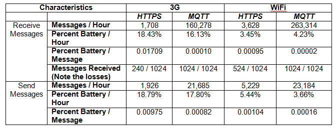

# meetup-santiagoscala-suscripcion-mqtt

Este proyecto es un ejemplo presentado en Meetup Santiago Scala del día 8 de Febrero del 2018, para el tema suscripción a un Broker utilizando el protocolo MQTT en Scala.

Antes de comenzar con la explicación  del código es importante destacar:


## ¿Que es MQTT?
MQTT (Message Queue Telemetry Transport), es básicamente un protocolo usado para la comunicación de Máquina a Máquina principalmente hoy en día en soluciones enfocadas para el "Internet de las Cosas".

## ¿A que esta orientado MQTT?
A la comunicación de sensores u otros dispositivos, gracias al consumo que este tiene, el cual es muy bajo en un ancho de banda y además el consumo de recursos (RAM, CPU, Batería, Etc...) que utiliza es mucho más bajo a comparación con otros protocolos como por ejemplo HTTP. 

A continuación se muestra una tabla de comparación entre el protocolo mqtt y http:




Ref: https://ibm.co/2BdReIZ

# Mqtt en Scala

Este ejemplo esta enfocado a mostrar una opción para establecer conexión por MQTT a un Broker con Scala utilizando la librería Paho.

La dependencia de la librería que se utiliza en este proyecto:
```scala
//Dependencias en SBT
libraryDependencies += "org.eclipse.paho" % "org.eclipse.paho.client.mqttv3" % "1.0.2"

resolvers += "MQTT Repository" at "https://repo.eclipse.org/content/repositories/paho-releases/"
```

## Pre Requisitos para esta demo:
* Scala versión 2.12.4
* SBT  versión  0.1.0
* Conexión a Internet para descargar la dependencias de la librería org.eclipse.paho.client.mqttv3

## Compilación: 

```sh
sbt compile
```

o desde el mismo IDE que utilices.

## Proyecto

Este proyecto contiene dos clases demos con un main las cuales son:

* EnvioMqttEjemplo: Esta contiene el código que muestra como enviar un mensaje a través del protocolo mqtt a un broker utilizando la libreria de Paho.

* SuscripcionMqttEjemplo: Esta contiene el código que permite suscribir a distintos topics y recibir mensajes des un broker por medio del protocolo MQTT.

Para probar este código es necesario tener levantado uno de los broker nombrados en la presentación adjunta en la carpeta ( [ScalaMQTT](https://drive.google.com/open?id=1gj4ikXWOL75jF4-hVZWNObzO0JXRKkyJo6-CmGJTCHg)) de anexos o puedes utilizar el ActiveMQ en Docker que dejo a continuación:

### Descargar ActiveMQ en Docker:

```sh
$ docker pull webcenter/activemq
```
### Iniciar ActiveMQ:
```sh
$ docker run --name='activemq' -d -e 'ACTIVEMQ_CONFIG_NAME=amqp-srv1' -e 'ACTIVEMQ_CONFIG_DEFAULTACCOUNT=false' -e 'ACTIVEMQ_ADMIN_LOGIN=admin' -e 'ACTIVEMQ_ADMIN_PASSWORD=admin' -v /data/activemq:/data -v /var/log/activemq:/var/log/activemq -p 8161:8161 -p 1883:1883 -p 5672:5672 -p 61616:61616 -p 61613:61613 webcenter/activemq
```
Para comprobar que ya esta arriba puedes ingresar desde un navegador a la url http://localhost:8161/admin

El usuario y contraseña que solicitara admin/admin (Por default)

Si tu broker lo levantas en otra host debes modificar la linea

```scala
val broker = new Broker("tcp://localhost:1883", MqttClient.generateClientId)
```
colocando la ip y el puerto de tu broker.


## Recomendación:

Para hace pruebas de envió de mas mensajes desde otro cliente externo puedes utilizar la extensiones de Google Chrome MqttBox (https://chrome.google.com/webstore/detail/mqttbox/kaajoficamnjijhkeomgfljpicifbkaf)
